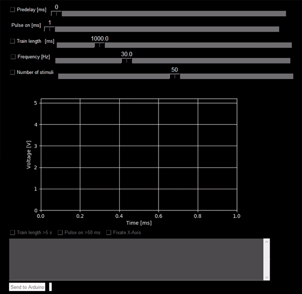

# Arduino-TTL-Trigger

I needed to synchronize the image acquisition of our microscope with our field stimulator, which itself needed a patterned TTL signal to create the desired eletric stimulus.

This build is based on an Arduino Nano which conveniently operates in the TTL voltage range of 3.3-5V. The Arduino checks whether a TTL signal was received and creates a square wave with a specified frequency. The Arduino is controlled via USB serial connection with a Python-based GUI.

Digital Pin 2 of the Arduino is configured as input. The input state is set to low with a 10 kΩ pull-down resistor to prevent floating when no input signal is present. Digital Pin 3 is configured as output with a 510 Ω current limiting resistor in series. The output TTL signal is also visualized via a flashing LED driven by digital pin 5 (with a 470Ω serial resistor). The momentary button connects digital pin 4, which uses the Arduino's built-in pull-up resistor, to ground when pushed to manually start the TTL train. Since the device is connected to a stimulator capable of producing hazardous electric currents, both input and output can be cut off with a DPST switch, which also controls two respective indicator LEDs.

For our setup, the input is connected to a Zeiss SVB-1 signal distribution box, which creates a short TTL pulse at the start of image acquisition. The output connects to a Warner Instruments SIU-102 bipolar stimulator, which creates the actual eletric stimulus according to the incoming TTL signal.

#### How to use
1. Connect to your PC and power the Arduino via USB
2. Upload the .ino file to the Arduino
3. Run the compiled TTL Trigger software
   * _Note: I compiled the python code with [PyInstaller](https://www.pyinstaller.org/), tested on Windows 10_
4. Select the serial port the Arduino is connected to. If the connection has been established you can proceed to the GUI

5. You can now determine the parameters for the output TTL signal:
   * Predelay [ms]: how long the delay between the received TTL signal and generated output TTL signal should be
   * Pulse on [ms]: duration of each pulse
   * At least two of the following parameters have to be determined:
      * Train length [ms or s]
      * Frequency [Hz]
      * Number of stimuli  
   * _Optional_: 
      * the pulse length and train length can both be extended  to 1-5000ms and 0.5 - 300s, respectively
      * the x-axis range can be manually adjusted

 
 6. Click "Send to Arduino" - you are now ready to go!
 
####  Bill of materials
|    Part    | Price [€]     | Note |
| :------------- |-------------:| :-------------|
| Arduino Nano V3 | [19.80](https://www.mouser.de/ProductDetail/Arduino/A000005?qs=sGAEpiMZZMuo%252B9%2FB%2FzhRUiA5OuslVcpmDXWBXfHAAwo%3D) | Cheaper Atmega328-based variants can be found for less than 7€ |
|BNC Socket, 2x| [2x 0.36](https://www.reichelt.de/bnc-einbaubuchse-zentralbefestigung-loetver-ug-1094u-p22014.html?&nbc=1) | - |
|SPDT Momentary Switch | [4.15](https://www.mouser.de/ProductDetail/633-MB241113) | _optional_ |
|DPST Switch, 2x | [2x 3.97](https://www.mouser.de/ProductDetail/633-M2021SS1W03) | _optional_ |
| LED, blue, 3 mm, 3x | [3x 0.10](https://www.reichelt.de/led-3-mm-blau-3800-mcd-30-rnd-135-00158-p263802.html?&nbc=1) | _optional_ |
| Through Hole PCB, 4x6 cm | [6.49](https://www.amazon.de/gp/product/B078HV79XX/ref=ox_sc_act_title_1?smid=A1X7QLRQH87QA3&th=1) | Set of 16 |
| 2.54 mm header socket | [2x 1.20](https://www.reichelt.de/praez-buchsenleisten-2-54-mm-1x20-gerade-mpe-115-1-020-p119956.html?&nbc=1) | _optional_ |
| Metal film resistors, 1/4 W, 1% | [4.95](https://www.ebay.de/itm/600-Metallfilm-Widerst%C3%A4nde-30-Werte-1-4W-1-Widerstand-Sortiment-Set-Kit-Arduino/162891782192?ssPageName=STRK%3AMEBIDX%3AIT&_trksid=p2057872.m2749.l2649) | Set of 600 |
| ABS housing, 119x99x45 mm | [8.99](https://www.amazon.de/gp/product/B07NVKCC1T/ref=ppx_yo_dt_b_asin_title_o06_s00?ie=UTF8&psc=1) | - |
| __total costs__ | __55.74__ | _Note: not including wire and shrinkwrap_ |

#### Known bugs / Limiations
* The program will crash if it cannot connect to the Arduino or a wrong port has been selected - I tried to include a serial timeout function but failed :-)
* Depending which two parameters are controlled, values for the third might lay outside the slider's display range but are non the less correctly calculated - always check the log box below the graph to check what settings will be sent to the Arduino
* The program will crash if you enter anything but an integer when manually adjusting the x-axis range
* Since I do not need the Arduino to do much, the square wave is generated by simply switching between _LOW_ and _HIGH_ states of the output pin with the [delay()](https://www.arduino.cc/reference/en/language/functions/time/delay/) function. As this could have [limitations](https://www.arduino.cc/en/tutorial/BlinkWithoutDelay) if I wanted to add more functionality, I might change this in the future.

#### References
* The complete serial communication code is adapted from Robin2's posts [here](https://forum.arduino.cc/index.php?topic=271097.0) and [here](https://forum.arduino.cc/index.php?topic=225329.msg1810764#msg1810764) in the [arduino.cc forum](https://forum.arduino.cc)
* The GUI was created using the amazing, easy-to-use [PySimpleGUI package](https://pysimplegui.readthedocs.io/en/latest/)
* Similar Arduino-based builds can be found [here](https://github.com/nakulbende/TTL_Trigger), [here](https://bakerdh.wordpress.com/2013/10/22/arduino-sound-to-ttl-trigger-for-eeg/) and [here](https://github.com/OptogeneticsandNeuralEngineeringCore/Arduino-TTL-Pulse-Generator-and-Controller)
* Great open-source options I would have opted for are [Pulse Pal](https://open-ephys.org/pulsepal) and especially [StimJim](https://open-ephys.org/stimjim)
* The cheapest commercial option I found is [PulserPlus by Prizmatix](https://www.prizmatix.com/Optogenetics/PulserPlus.htm) 

#### Limitation of Liability
I will not be liable for damages or losses to hardware or personal health from using the published code or builds based on the one shown here.
